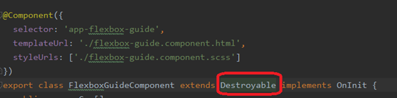
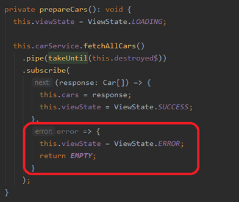

# library-sa

Aby odpalić projekt najpierw należy zainstalować zależności: 
<b>npm i</b>

Nastepnie należy odpalić fake server, który zwraca dane ustawione w pliku db.json:
 
<b>json-server --watch fake-server/db.json --routes fake-server/routes.json</b>

Następnie należy odpalić projekt poprzez: 
<b>npm start</b>

Adres aplikacji: 
[localhostL4200](localhostL4200)
 

# 10 Dobrych praktyk

### 1. Dodawanie dolarka na końcu zmiennej strumieniowej "nazwaZmiennej$"

Bardzo ważna konwencja nazewnicza. Polega ona na tym, aby dodawać dolarka „$” na końcu nazwy do zmiennych strumieniowych takich jak Observable oraz Subject.

 Przykład w kodzie => [task.component.ts](src/app/components/tasks/tasks.component.ts) linia 26 
 
 
Konwencja ta zwiększa czytelność kodu. Gdy patrzysz na kod i na końcu zmiennej widzisz dolara, to wiesz, że jest to zmienna strumieniowa, dzięki czemu od razu wiesz, że możesz skorzystać z dodatkowych funkcjonalności, jakie strumienie dostarczają.

### 2. Odsubskrybowanie ze strumienii

#### Subskrypcja w komponencie

Jedną z pierwszych dobrych praktyk w Angularze, jest pamiętanie, aby odsubskrybować się od zmiennych strumieniowych. Zapobiega to wyciekom pamięci. Działa to w taki sposób, że odsubskrybowanie dokonywane jest najczęściej podczas niszczenia komponentu. Odpowiedzialny jest za to interfejs OnDestroy oraz nadpisanie metody ngOnDestroy, gdy dokonujemy subskrypcji w komponencie.

 Przykład w kodzie => [flexbox-guide.component.ts](src/app/components/layout-manager/flexbox-guide/flexbox-guide.component.ts) linia 51

Aby mieć dostęp do zmiennej <b>this.destroyable$</b> komponent musi rozszerzyć klasę <b>Destroyable</b>.
(Należy pamiętać, że klasa Destroyable, to customowe rozwiązanie, które możesz dodawać do swoich projektów.)

 Przykład w kodzie => [flexbox-guide.component.ts](src/app/components/layout-manager/flexbox-guide/flexbox-guide.component.ts) linia 18

##### Klasa Destroyable i nadpisana metoda ngOnDestroy

 Przykład w kodzie => [destroyable.ts](src/app/components/destroyable.ts)

#### Subskrypcja w szablonie

Gdy dokonujemy subskrypcji w szablonie, najpierw powinniśmy przypisać wartość strumienia do zmiennej.

 Przykład w kodzie => [tasks.component.ts](src/app/components/tasks/tasks.component.ts) linia 26

Następnie powinniśmy dokonać subskrybcji na tej zmiennej w szablonie poprzez korzystanie z wbudowanego pipe’a <b>async</b>. 

 Przykład w kodzie => [tasks.component.html](src/app/components/tasks/tasks.component.html) linia 26

Wbudowany pipe <b>async</b> samodzielnie zadba o to, aby dokonać odsubskrybowania.

### 3. Korzystanie z "early return"

Praktyka ta polega jak sama nazwa wskazuje na wczesnym zakończeniu wykonywania np. funkcji.  
Chodzi tutaj o to, żeby sprawdzić najpierw warunek, który z definicji powinien zakończyć wywołanie funkcji i nie pozwolić przejść dalej, ponieważ byłoby to bezsensowne.  
W tym przypadku sprawdzamy najpierw czy istnieje kolor w postaci hex. Może się zdarzyć, że do funkcji zostanie przekazana wartość null albo undefined. Jeżeli tak się stanie, to po prostu zwracamy pusty return, który wychodzi z funkcji.

 Przykład w kodzie => [color.helper.ts](src/app/helpers/color.helper.ts) linia 2-5

### 4. Korzystanie z "Elvis operator"

Operator ten pozwala na sprawdzenie czy obiekt poprzedzający znak zapytania istnieje.

 Przykład w kodzie => [car-card.component.html](src/app/components/car-card/car-card.component.html) linia 1 

Gdyby zastosować klasyczne podejście kod wyglądałby w następujący sposób: 

Musielibyśmy najpierw sprawdzić czy istnieje obiekt <b>car</b> i dopiero po takim sprawdzeniu odwołać się do zmiennej photoSource.
Tzw. <b>"Elvis operator"</b>, pozwala skrócić ten zapis ponieważ zapis <b>car?.photoSource</b> sprawdza samoistnie, czy w tym przypadku, obiekt car istnieje.

### 5. Łapanie błędów poprzez catchError
Bardzo ważne w aplikacji, aby dodawać obsługę błędów i aby świadomie nią zarządzać.  
Angular udostępnia dwa sposoby na złapanie błędów:

1) Łapanie błędów w ciele subscribe: 

2) Łapanie błędu przed subscribe przy wykorzystaniu operatora <b>pipe</b>: 

Z moich wieloletnich doświadczeń oraz wielogodzinnych dyskusji w zespołach doszliśmy do wniosku, że lepszą praktyką jest korzystać z operatora catchError przy wykorzystaniu operatora pipe.  
Dlaczego takie rozwiązanie wydaje się bardziej eleganckie i jest preferowane?  
Przede wszystkim ciało subskrypcji, powinno być tzw. happy path’em, czyli ścieżką gdy wszystko wykonało się poprawnie. W subscribe oczekujemy rezultatu/odpowiedzi.  
Z tego powodu, powinniśmy zadbać o to, aby wszelkie błędy złapać zanim przejdziemy do happy path, czyli do pobrania odpowiedzi.

### 6. Dodanie viewState
 
Z reguły, gdy działamy z naszym komponentem posiada on różne stany. Najczęstszym przypadkiem jest pobranie danych do komponentu, np. listy samochodów albo danych do wykresów.  
Pobranie danych dzieje się asynchronicznie oraz niejednokrotnie może trwać jakiś określony czas.
Gdy zapytania są małe i dostajemy odpowiedź niemal natychmiastowo problem nie jest widoczny na pierwszy rzut oka.   
Natomiast, gdy zapytanie trwa np. sekundę lub dwie, może się okazać, że potrzebujemy zarządzić stanem komponentu.  
Najczęstsze stany jakie możesz spotkać to <b>SUCCESS</b> czyli, gdy udało się poprawnie pobrać dane, <b>ERROR</b>, gdy coś poszło nie tak i dane nie mogą być pobrane z jakiegoś powodu oraz <b>LOADING</b> podczas ładowania danych (które trwa np. dwie sekundy)  
Stan danego kontenera (w tym przypadku mówimy o kontenerze, ka tej zmiennej w szablonie poprzez korzystanie z wbudowanetóry wyświetla samochody) na samym początku powinien być ustawiony jako <b>LOADING</b>. 

 Przykład w kodzie => [flexbox-guide.component.ts](src/app/components/layout-manager/flexbox-guide/flexbox-guide.component.ts) linia 24  

 
Widok kontenera dla stanu <b>LOADING</b>

Kolejne ustawienie stanu na <b>LOADING</b> odbywa się podczas każdej zmiany filtrów i próby pobrania danych z backendu.

 Przykład w kodzie => [flexbox-guide.component.ts](src/app/components/layout-manager/flexbox-guide/flexbox-guide.component.ts) linia 43

Gdy wszystko pójdzie dobrze i przejdziemy do "happy path", czyli pobierzemy dane w ciele subscribe powinniśmy ustawić status na <b>SUCCESS</b>.  

 
Widok kontenera dla stanu <b>SUCCESS</b>

Istnieje także ścieżka niepowodzenia. Może się okazać, że serwer jest tymczasowo niedostępny, albo wykonaliśmy błędne zapytanie. W takim przypadku otrzymamy błąd i poprzez użycie <b>catchError</b>, o którym wspomniałem wyżej, możemy ustawić status kontenera na <b>ERROR</b>.

 
Widok kontenera dla stanu <b>ERROR</b>

Dzięki dodaniu stanów możemy w łatwy i klarowny sposób zarządzać wyglądem kontenera i odpowiednio reagować na różne zdarzenia i stany.  
Domyślnie taki mechanizm nie jest dostarczony w świeżym projekcie Angulara, natomiast stworzyłem go dla Ciebie w bibliotece.
Komponent za to odpowiedzialny to [app-view-state.component.ts](src/app/components/view-state/view-state.component.ts)  

W zależności od wartości zmiennej viewState wyświetli się odpowiedni wygląd kontenera (ładowanie = LOADING, pobranie danych = SUCCESS, błąd = ERROR)

 Przykład w kodzie => [flexbox-guide.component.html](src/app/components/layout-manager/flexbox-guide/flexbox-guide.component.html) linia 43

### 7. Poprawne wykorzystanie enumów w szablonie

Bardzo często zdarza się, że zdefiniowaliśmy sobie w aplikacji enumy i chcielibyśmy je wykorzystać w szablonie HTML.   
Aby tego dokonać, musimy najpierw zaimportować takie enumy i przypisać je do zmiennej w komponencie tego szablonu:

 Przykład w kodzie => [view-state.component.ts](src/app/components/view-state/view-state.component.ts) linia 12

Robimy to poprzez dodanie operatora widoczności public następnie nadajemy nazwę zmiennej. W tym przypadku jest to zmienna ViewState (tak samo nazywa się enum), następnie dodajemy dwukropek oraz po dwukropku podajemy słówko kluczowe „typeof” i podajemy typ naszego enuma.   
W naszym przypadku jest to typ ViewState, następnie dodajemy znak zapytania w celu przypisania wartości do zmiennej oraz przypisujemy wartość całego enuma czyli właśnie ViewState.  
Wykorzystana jest tutaj także konwencja nazewnicza, aby nazwa tej zmiennej była napisana z wielkiej litery. Dzięki temu gdy wykorzystamy tę zmienną w szablonie to od razu widać, że mowa o enumie.

 Przykład w kodzie => [view-state.component.html](src/app/components/view-state/view-state.component.html)

### 8. Korzystanie z enuma podczas tworzenia formularzy

Praktycznie w 99% poradników, podczas tworzenia formularza napotkasz się na następujące podejscie:  
Klucze będą tworzone poprzez wpisanie ich jawnie, natomiast dobrą praktyką, jest utworzenie enuma, który przechowuje klucze formularza, a następnie reużywanie ich w wielu miejscach.

 Klucze utworzone ręcznie

 Klucze utworzone przy pomocy enumów. Przykład w kodzie => [add-car-form.service.ts](src/app/services/add-car-form.service.ts) linia 17-21

 Przykład w kodzie => [add-car-dialog-form.component.html](src/app/components/layout-manager/add-car-dialog-form/add-car-dialog-form.component.html) linia 11

### 9. Funkcje exportowane zamiast klas Utils

W wielu językach (szczególnie w Javie), aby wyodrębnić wspólne funkcje, które chcemy wykorzystać w wielu miejscach w kodzie, utworzymy tzw. klasę utils.   
Będzie to klasa, która będzie posiadała funkcje statyczne:

 

 

W Angularze dobrą praktyką w takiej sytuacji jest skorzystanie z funkcji eksportowanych. 

 Przykład w kodzie => [form.helper.ts](src/app/helpers/form.helper.ts)

 Przykład w kodzie => [ input.component.ts](src/app/components/form/input/input.component.ts) linia 19

### 10. Korzystanie z ng-container, przy warunkach

Często spotykałem/spotykam się z podejściem, że sprawdzenie czy lista obiektów istnieją zostaje dodane na tagu div lub section. Problem z takim podejściem jest taki, że gdy w naszym przypadku samochody będą istniały to w wynikowym kodzie DOM, zostanie dodany nadmiarowy pusty div

 

Mógłbyś zadać pytanie, dlaczego nie można dodać w tym przypadku ngIf’a na tagu app-car-card. Dzieję się tak ponieważ, na tym tagu została już wykorzystana jedna dyrektywa strukturalna jaką jest ngFor, a na jednym tagu można wykorzystać tylko jedną dyrektywę.  
Lepszym rozwiązaniem w takiej sytuacji, jest skorzystanie z tagu ng-container. Przewagą tej dobrej praktyki jest fakt, że gdy samochodu będą istniały, nie zostanie dodany pusty tag div, ponieważ ng-container nie odkłada się w wynikowym DOM’ie.

 Przykład w kodzie => [flexbox-guide.component.html](src/app/components/layout-manager/flexbox-guide/flexbox-guide.component.html) linia 45
